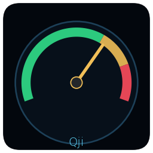

# Qji Peak Monitor

Qji（奏在）の最終出力段をリアルタイムに可視化する、スタンドアロンのオーディオ
ピークメーターです。`ffmpeg`の`astats`フィルターが書き出すログを読み取り、
アナログVUメーター風のステレオ針メーター・水平レベルバー・信号履歴グラフを
表示します。



## 特徴

- ステレオ針メーター(L/R)＋水平ピークレベルメーター
- 直近の信号推移を表示する SIGNAL PROFILE グラフ
- しきい値超えを検知する PEAK HIT カウンター
- DSP再生時など、実際に音が聞こえるタイミングと表示のズレを補正する
  **ディスプレイディレイ機能**
  - 起動時に`--display-delay`で秒数指定
  - 起動後も矢印キーでリアルタイム微調整(← → で0.1秒刻み、↑ ↓ で0.5秒刻み)
  - 数字キーで直接入力してEnterで確定も可能(例: `9` → `.` → `5` → Enter)
  - `r`キーで起動時の値にリセット
- 常に最前面表示、初期ウィンドウサイズのカスタマイズに対応

## 動作環境

- Linux(Xubuntu / Ubuntu等、X11環境を想定)
- Python 3
- `python3-tk`
- `matplotlib`
- `numpy`
- `ffmpeg`(Qji本体側で`astats`ログを出力していること)

## インストール

### 方法A: ダブルクリックでインストール(ターミナル操作不要)

1. このリポジトリをZIPでダウンロード(または`git clone`)して展開する
2. 展開したフォルダの中にある **「Qji Peak Monitor をインストール」**(`INSTALL.desktop`)を
   ダブルクリックする
3. 初回は「信頼して起動しますか?」といった確認ダイアログが出ることがあるので、
   「起動する / Trust and Launch」を選ぶ
4. ターミナルが開いてインストールが進み、完了すると「Enterキーを押すと閉じます…」と
   表示されるので、Enterキーを押して閉じる

これでアプリケーションメニューとデスクトップに「Qji Peak Monitor」のアイコンが
追加され、以後はそのアイコンをダブルクリックするだけで起動できます。

> ダブルクリックしても何も起こらない、または「開くアプリケーションの選択」と
> 聞かれてしまう場合は、方法Bのターミナルからのインストールをお試しください。
> (ファイルマネージャーの設定によっては、`.desktop`ファイルの実行が既定で
> 許可されていないことがあります)

### 方法B: ターミナルからインストール

```bash
git clone https://github.com/<your-username>/qji-peak-monitor.git
cd qji-peak-monitor
./install.sh
```

どちらの方法でも、`install.sh`は以下を行います:

- 依存パッケージ(`python3-tk` / `matplotlib` / `numpy`)の有無を確認
- 本体一式を `~/.local/share/qji-peak-monitor/` に配置
- 起動用ランチャーを `~/.local/bin/qji-peak-monitor` に作成
- アプリケーションメニューへの登録(`~/.local/share/applications/`)
- デスクトップへのショートカット作成

いずれもユーザーのホームディレクトリ配下への配置のみのため、`sudo`は不要です
(依存パッケージが不足している場合のみ、インストールコマンドの案内が表示されます)。

### アンインストール

```bash
./uninstall.sh
```

> **補足**: GitHubの「Download ZIP」やクラウドストレージ経由で受け取った場合など、
> 実行属性(実行権限)が失われて`INSTALL.desktop`や`install.sh`をダブルクリックしても
> 反応しないことがあります。その場合はターミナルで一度だけ以下を実行してください:
> ```bash
> chmod +x install.sh uninstall.sh INSTALL.desktop
> ```
> `git clone`で取得した場合は通常この操作は不要です。

## 使い方

デスクトップアイコン、またはアプリケーションメニューから起動できます。

ターミナルから起動する場合:

```bash
qji-peak-monitor [オプション]
```

### 主なオプション

| オプション | 説明 | デフォルト |
|---|---|---|
| `--log-glob` | 監視するastatsログファイルのglobパターン | (スクリプト内既定値) |
| `--threshold` | ピークヒット判定のしきい値(dBFS) | (スクリプト内既定値) |
| `--window` | SIGNAL PROFILEグラフの表示秒数 | 20.0 |
| `--floor` | メーターの下限(dBFS) | (スクリプト内既定値) |
| `--width-scale` | 初期ウィンドウ横幅の倍率 | 0.5 |
| `--height-scale` | 初期ウィンドウ高さの倍率 | 1.0 |
| `--no-topmost` | 常に最前面表示を無効化 | (最前面表示が既定) |
| `--display-delay` | 表示を遅らせる秒数(実際に聞こえるタイミングに合わせる) | 0.0 |
| `--refresh-ms` | 画面更新間隔(ミリ秒) | 100 |

例(DSP再生時、2.5秒遅らせて起動):

```bash
qji-peak-monitor --display-delay 2.5
```

### キーボード操作(起動後)

| キー | 動作 |
|---|---|
| `0`〜`9`、`.` | ディスプレイディレイの数値直接入力モードを開始 |
| `Enter` | 入力した数値を確定 |
| `Backspace` | 入力中の一文字を削除 |
| `Esc` | 入力をキャンセル |
| `←` / `→` | ディスプレイディレイを0.1秒刻みで調整 |
| `↑` / `↓` | ディスプレイディレイを0.5秒刻みで調整 |
| `r` | ディスプレイディレイを起動時の値にリセット |

## 仕組み

`astats`フィルターはffmpegのフィルターチェーンの最終段(音声を次段へ渡す直前)
で計測しているため、SIGNAL PROFILEグラフの右端は「ffmpegが処理を終えて次段
(ALSA出力やDSPループバック)へ渡した瞬間」を表します。実際にスピーカーで
聞こえるまでには、ALSAバッファやDSPのキューといった下流の遅延が加わるため、
`--display-delay`でその分を補正して表示できます。

## ライセンス

（ここにライセンスを指定してください。例: MIT）
